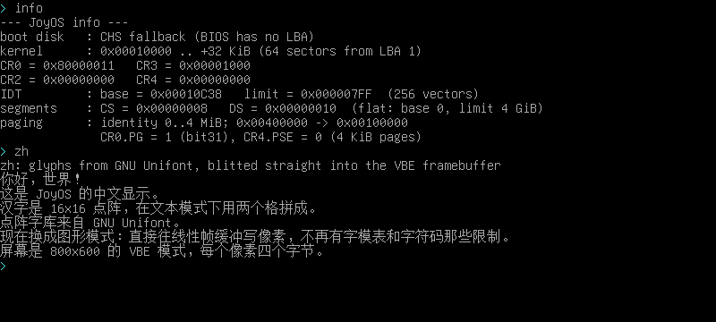

# JoyOS(胡闹OS)



一个**从头写的、只有 2000 多行的 x86 操作系统**,能启动、能分页、能敲键盘、有个自己的 shell。
没有引用任何现成内核 —— 引导扇区是手写的机器码级汇编,VGA 输出、中断、页表全靠自己填。

写它的目的不是"做个能用的系统",而是**把 计算机启动到底发生了什么 一层层摊开给你看**:
从 BIOS 把 512 字节读进 0x7C00,到 GDT/保护模式/IDT/分页/键盘中断,每一段都在源码注释里讲清楚,
包括**踩过的坑**(下面有专门一节)。

> 你可以随便改。改坏了 `make test` 会告诉你哪一项坏了。

---

## 1. 现在能干什么(阶段 5 完成)

| 功能 | 说明 |
|---|---|
| 启动 | 512 字节引导扇区,BIOS 传统 MBR 方式加载到 `0x7C00` |
| **多扇区读盘** | 一次读多个扇区把 32 KiB 内核搬进内存;**LBA(EDD)和 CHS 两条路径都有**,自动探测 |
| 保护模式 | GDT(代码段 + 数据段,平坦 4 GiB)、`CR0.PE`、32 位段寄存器全部就位 |
| IDT | 256 个中断门,0~31 号 CPU 异常都有处理程序,出错就红屏报**异常名 / 错误码 / EIP / CS / EFLAGS**(页错误还会报 CR2) |
| 分页 | 页目录 + 页表,恒等映射前 4 MiB,另外把 `0x400000` 映到物理 `0x100000`,开 `CR0.PG` |
| 键盘 | 8259A 重映射到 `0x20`,IRQ1 中断方式收键,扫描码翻译表(含 Shift),64 字节环形缓冲 |
| 终端 | 会滚屏的 VGA 文本终端(80×25),支持 `\n` `\r` `\b`,硬件光标跟着跑 |
| shell | `help` `echo` `clear` `info` `page` `fault` `reboot`,带退格的行编辑 |

## 2. 快速开始

需要 `nasm`、`qemu-system-i386`、`python3`:

```bash
# Debian/Ubuntu
sudo apt install nasm qemu-system-x86 python3

make                    # 构建 build/joyos.img(1.44MB 软盘镜像)
make run                # 开窗口在 QEMU 里跑(自己敲键盘玩)
make test               # 无头自动化测试:6 组,全过会打 ✅
make clean              # 清掉 build/

./tools/run.sh          # 启动脚本:自动构建 + 选"怎么挂盘"
./tools/run.sh --hdd    #   当硬盘挂 → 会走 LBA/EDD 那条路
./tools/run.sh --div    #   开机就除零 → 直接看 panic 屏
./tools/run.sh --gdb    #   开 gdb 调试端口(-s -S)
./tools/run.sh --monitor #  把 QEMU monitor 接到终端(能 sendkey / xp 读显存)
./tools/run.sh --dry-run #  只打印 qemu 命令行,不启动(排错用)
QEMU_DISPLAY=none ./tools/run.sh   # 无窗口跑
```

QEMU 窗口里的常用键:`Ctrl+Alt+g` 放开鼠标键盘抓取,`Ctrl+Alt+2` 切到 monitor 控制台(`Ctrl+Alt+1` 切回来)。

`make test` 的 6 组(每组都真的启动 QEMU、抓 VGA 显存、断言屏幕内容):

| 目标 | 测什么 |
|---|---|
| `test-fda` | 当**软盘**启动 → 走 CHS 退回路径 |
| `test-hda` | 当**硬盘**启动 → 走 LBA/EDD 路径 |
| `test-div` | 故意除零 → 0 号异常,panic 屏要出现 |
| `test-pgfault` | shell 里敲 `fault` → 14 号页错误,CR2 要等于出错地址 |
| `test-kbd` | 用 QEMU monitor 的 `sendkey` **真按键**,验证回显、Shift、回车、退格 |
| `test-shell` | 敲 `help`/`info`/`page`/`echo`/`clear`,验证命令、滚屏、清屏 |

```bash
make test-fda      # 单独跑某一组
make div           # 构建"开机就除零"的镜像,自己开着 QEMU 看 panic 屏
python3 tests/qemu_test.py build/joyos.img --dump    # 只把屏幕打出来,不做断言(调试用)
```

## 3. 源码地图

```
boot/boot.asm          引导扇区(必须在 512 字节内):读盘 → GDT → 保护模式 → 跳内核
kernel/kmain.asm       内核入口 + 终端驱动(滚屏、光标、十六进制/十进制打印)
kernel/idt.asm         IDT、32 个异常入口、panic 屏
kernel/paging.asm      页目录 + 页表 + 开分页
kernel/keyboard.asm    8259A 重映射、IRQ1 键盘中断、扫描码翻译、环形缓冲
kernel/shell.asm       shell:行编辑、命令解析、各命令实现
tools/mkimg.py         把 boot.bin(第 0 扇区)+ kernel.bin(从第 1 扇区)拼成镜像
tools/run.sh           QEMU 启动脚本(软盘/硬盘/panic 演示/gdb/monitor/dry-run)
tests/qemu_test.py     无头测试:monitor socket 抓 VGA + sendkey 注入按键
tests/probe_disk.asm   探针:实测"软盘到底支不支持 LBA 读"(见第 4 节)
```

内核是**平坦二进制 + `%include`**,没有用链接器 —— 所有 `.asm` 在同一个翻译单元里,
所以 `kernel/*.asm` 之间可以直接互相调用。这样简单,代价是符号名不能重复。

内存布局(这个阶段的约定,写死在代码里):

```
0x000000 - 0x0004FF   中断向量表 / BIOS 数据区
0x001000 - 0x003FFF   页目录 + 页表        (paging.asm)
0x007C00              引导扇区(512 字节)
0x010000 - 0x017FFF   内核本体(32 KiB = 64 扇区)
0x090000              内核栈(往下长)
0x0B8000              VGA 文本缓冲(80×25,每格 2 字节:字符 + 颜色)
```

## 4. 踩过的坑(这部分才是精华)

### 4.1 软盘的 BIOS 不支持 LBA 扩展读

最开始只写了 `int 0x13 AH=42h`(LBA 扩展读,一次读 8 个扇区),结果 QEMU 里直接 `DISK READ FAILED`。

用 `tests/probe_disk.asm` 探针实测了三种读法(同一个镜像,分别当软盘和硬盘挂):

| 读法 | 软盘 `-fda` | 硬盘 `-hda` |
|---|---|---|
| `AH=42h` LBA 读 8 扇区 | ❌ `CF=1 AH=01`(功能无效) | ✅ 成功,数据正确 |
| `AH=02h` CHS 读 1 扇区 | ✅ 成功,数据正确 | ❌ `CF=1 AH=20`(几何不对) |
| `AH=41h` EDD 支持探测 | `CF=1`(老实说"不支持") | `CF=0` |

**结论**:软盘的 BIOS 压根不认 LBA 扩展读,只有硬盘认。所以正确做法是:

1. 先问 `AH=41h` 支不支持(检查 `CF`、`BX=0xAA55`、`CX` 的 bit0)
2. 支持 → 走 LBA,一次读 8 扇区
3. 不支持 → 退回 CHS,**而且每次都要截断到"本磁道还剩几扇区"**(CHS 读不能跨磁道)

`boot/boot.asm` 现在两条路都有,`make test-fda` / `make test-hda` 各测一条。
这个探针留在 `tests/probe_disk.asm` 里 —— 你要是换个 BIOS 环境,先跑它。

### 4.2 panic 屏里 EFLAGS 多了个 bit16,不是 bug

除零的 panic 屏打出 `EFLAGS = 0x00010046`,而开机时明明是 `0x00000046`,多出来的 `0x10000` 是 bit16(RF,Resume Flag)。
这是 CPU 自己加的:**故障类异常会把 RF 压进异常帧**,这样 `iret` 回去重试那条指令时不会立刻又炸一次。
我为了这个 `0x10046` 查了一轮(还先把它错看成了 bit8 的 TF),最后在 `idt.asm` 里写清楚了。

### 4.3 同一行连续打印会被自己盖掉 / `div` 会冲掉颜色寄存器

- 早期 VGA 驱动每次打印都"回到行首",导致同一行第二次 `print` 把第一次的内容盖了 ——
  后来改成**只有换行才重新定位**。
- 打印十进制时用 `div`,而 `div` 会把 `edx` 当余数输出 —— 而颜色正好存在 `dl` 里,
  结果数字颜色全乱。改成**颜色存内存**,不放在寄存器里。

### 4.4 VGA 文本模式只有 ASCII 字形

屏幕上写中文会变成乱码(BIOS 自带字模只有 ASCII)。
所以**代码注释全是中文,但所有会显示出来的字符串都是英文**。

注意别想着"换个字模就能显示中文":VGA 文本模式一个字符格**只有 8 像素宽**
(字模是 8×N 的点阵,高度可以用 CRTC 的 Maximum Scan Line 调到 16 甚至 32),
而标准汉字是 **16×16** —— 8 像素宽的格子根本塞不下一个汉字,换字模也救不了。
真要显示中文只有进图形模式自己画点阵(见第 7 节)。

## 5. shell 命令

```
help          列出命令
echo <text>   把文字打回来
clear         清屏
info          CR0/CR2/CR3/CR4、IDT 基址与限长、段寄存器、读盘方式
page <hex>    逐级走页表,查虚拟地址映射到哪(例:page 0x400000)
fault         故意踩没映射的地址,看页错误 panic 屏
reboot        重启(通过 8042 键盘控制器)
```

`page` 的输出示例(这就是分页在干的事):

```
> page 0x400000
virtual      = 0x00400000
PDE index    = 0x00000001 [1] = 0x00003003  present + writable
PTE index    = 0x00000000 [0] = 0x00100003  present
physical     = 0x00100000
> page 0x800000
virtual      = 0x00800000
PDE index    = 0x00000002 [2] = 0x00000000  PDE not present -> would page-fault
```

## 6. 怎么改(五分钟能见效的几个)

改完 `make` 一下,`./tools/run.sh` 就能看到效果。

### 6.1 改开机那句话

`kernel/kmain.asm` 最下面的数据区,`msg_title` 就是第一行:

```asm
msg_title   db 'JoyOS - stage 5', 10, 0     ; 10 = 换行,0 = 字符串结束
```

**注意**:VGA 文本模式只有 ASCII 字形,写中文会变成乱码(见 4.4)。

### 6.2 加一条 shell 命令

三处,都在 `kernel/shell.asm`:

```asm
; 1) 写处理函数(想打印就用 term_print,想读参数用 [cmd_arg])
cmd_hi:
    mov esi, msg_hi
    call term_print
    ret

msg_hi db 'hi there', 10, 0                 ; 2) 加字符串

; 3) 在命令表里登记(名字 + 处理函数)
n_hi db 'hi', 0
cmd_table:
    dd n_hi, cmd_hi
    ...
```

命令名匹配是**整词**比较(`str_eq`),所以 `page` 不会被 `pa` 之类误命中。

### 6.3 改分页怎么映射

`kernel/paging.asm` 顶部:

```asm
DEMO_VADDR  equ 0x00400000      ; 虚拟地址
DEMO_PADDR  equ 0x00100000      ; 映到哪块物理内存
```

改完在 shell 里 `page 0x400000` 就能看到 PDE/PTE 变了。想让它"映了但不许写",
把那项的 `PAGE_RW` 去掉(变成只读),写它就会吃 13 号通用保护异常。

### 6.4 让 panic 屏显示更多

`kernel/idt.asm` 里 `isr_common` 就是那个"红屏 + 停机"。异常帧里的东西都在栈上:

```
[ebp+32]=向量号  [ebp+36]=错误码  [ebp+40]=EIP  [ebp+44]=CS  [ebp+48]=EFLAGS
```

想再打 `CR3`、`DS`、或者页表项,照着 `mov eax, cr2 / call term_print_hex` 那样加一行就行。

### 6.5 想看汇编到底编成了什么

```bash
make lst        # 生成 build/boot.lst 和 build/kernel.lst(带机器码的反汇编)
qemu ... -s -S  # 配合 gdb:target remote :1234
```

## 7. 中文显示(实验中,详见 font/README.md)

`font/` 目录里放的是 **GNU Unifont** 的点阵字形,以及用它生成的 VGA 文本模式字模表。
默认构建**不启用**它(见 `%ifdef USE_CUSTOM_FONT`),因为文本模式这条路还有没解决的问题;
想看实验效果:`make run USE_CUSTOM_FONT=1`(或 `make -B build/kernel.bin USE_CUSTOM_FONT=1`)。

已验证/已查明的东西(细节和寄存器公式见 [font/README.md](font/README.md)):

* VGA 文本模式的字模在 **plane 2**,字符发生器**每字符占 32 字节**(不是 16)
* 用哪张字模表由**属性字节的 bit3** 决定,和字符码无关
* 文本模式下必须先把 **GC 0x06 的内存映射位**清 0,否则往 A0000 写字模全部写进空气
  (这条是实测出来的:全填 `0xFF` 后屏幕变满屏方块才算确认)
* 汉字在文本模式里只能"劈成两半、占两个字符格",**上限 63 个字**

还差的一步:字模确实进了显存(把空格字模改成方块 → 整屏 44% 墨迹),但具体字符渲染出的像素
和表里的字节不是 1:1(疑似和 8/9 点时钟切换后的表面尺寸有关)。**结论:这条路收益有限,
下一步直接走图形模式(VBE + 线性帧缓冲)自己 blit 点阵更划算。**

## 8. 还没做的(想练手就从这里挑)

- **PIT 定时器(IRQ0)**:有了它才能做 `uptime`、闪烁光标、`sleep`
- **光标键 / Home / End**:要处理扫描码的 `0xE0` 前缀
- **更多 shell 命令**:`mem`(要先用 BIOS `int 0x15 E820` 问内存图)、`hexdump`、`calc`
- **自己的点阵字库(顺便想想中文)**:现在屏幕上的字全是 BIOS 自带的 8×16 ASCII 字模。
  能改的是字模本身 —— 文本模式下用 `int 0x10 AX=1110h` 加载自己的 8×16 字模,
  或者进保护模式后直接往 VGA plane 2 写字模数据 —— 所以你自己画的 8×16 图标、
  极简字是能显示出来的。但**标准汉字是 16×16,塞不进 8 像素宽的字符格**:
  要正经中文得先切图形模式(VBE 800×600),自己往帧缓冲上画点阵,
  字库还得从磁盘读(HZK16 一个字库约 216 KB → 得先有文件系统)。
  最费劲,也最有成就感。
- **改 GDT 做真正的用户态**:加 TSS、ring 3 代码段,用 `int 0x80` 做系统调用
- **把页表放到别处 / 动态分配**:现在页目录是硬编码在 `0x1000`
- **文件系统**:现在读盘是按 LBA 裸读,连 FAT12 都还没有
- **鼠标(IRQ12)**:PS/2 鼠标比键盘多几个坑(要发命令、读 3 字节包)

## 9. 许可

MIT —— 随便用、随便改、随便抄(见 [LICENSE](LICENSE))。
要是这个仓库帮你搞懂了保护模式或者分页,那就够了。
