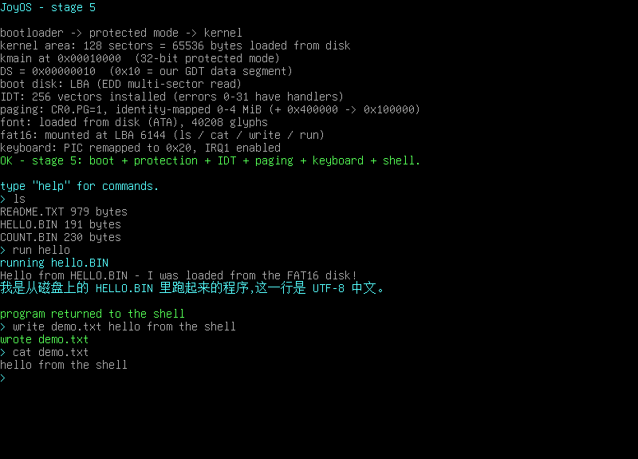
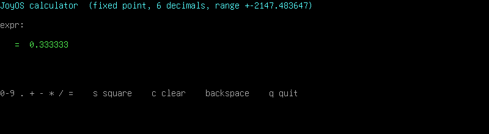
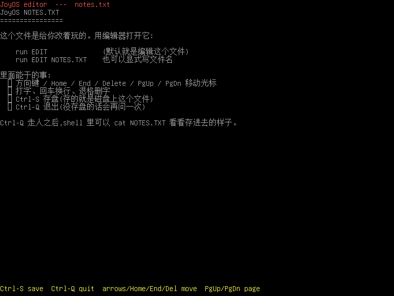
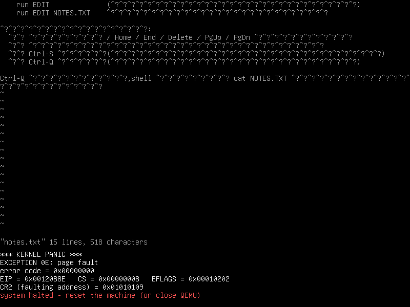
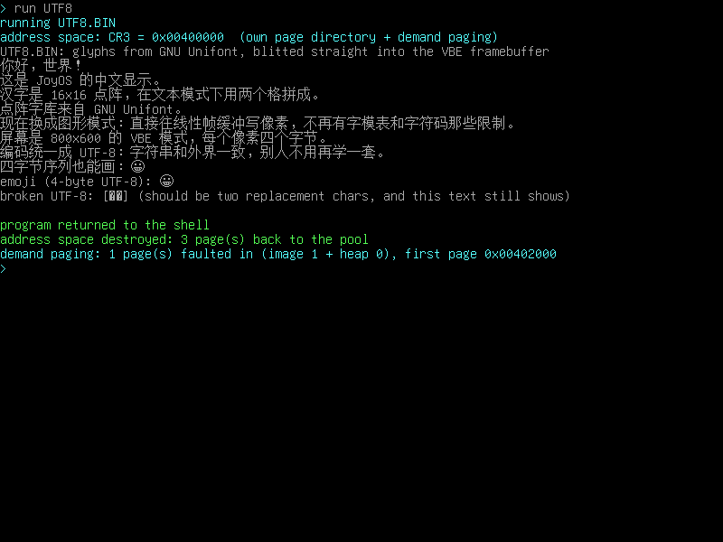
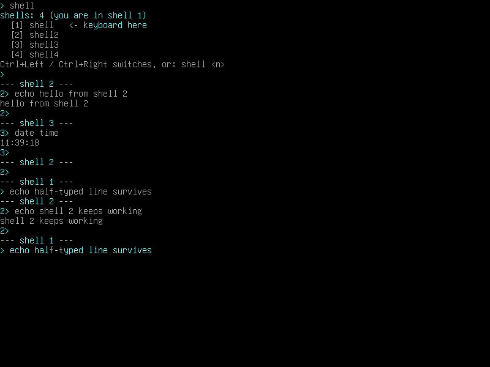

# JoyOS(胡闹OS · 演示版)



上图是完整硬盘镜像的实拍:字库从磁盘读进来(40 208 个字形)、FAT16 挂上了,
`ls` 列目录、`run HELLO` 跑磁盘上的程序、`write` / `cat` 读写文件。

两个"用 int 0x30 写出来的组件":**计算器**(`run CALC`,定点小数、加减乘除、平方)
和**全屏文本编辑器**(`run EDIT`,方向键、存盘、打开):




**vi 也搬进来了** —— 不是从头写的,是公有领域的 STEVIE(vim 的前身):



还有图形模式(800×600 VBE)里敲 `info` 和 `run UTF8`(中文 / emoji 演示)的样子:

 

一个**从头写的、4000 多行的 x86 操作系统**,能启动、能分页、能读硬盘、
有自己的文件系统和 shell,还能**跑你写的小程序**。
没有引用任何现成内核 —— 引导扇区是手写的机器码级汇编,VGA 输出、中断、页表、ATA 驱动全靠自己填。

写它的目的不是"做个能用的系统",而是**把 计算机启动到底发生了什么 一层层摊开给你看**:
从 BIOS 把 512 字节读进 0x7C00,到 GDT/保护模式/IDT/分页/键盘中断/ATA 读盘/FAT16,
每一段都在源码注释里讲清楚,包括**踩过的坑**(下面有专门一节)。

> 你可以随便改。改坏了 `make test` 会告诉你哪一项坏了。
>
> 想最快见效?**别碰内核,写个程序丢到磁盘上跑** —— 见 [docs/programs.md](docs/programs.md)。

---

## 键盘打中文/日文/韩文:Alt 码位输入

键盘只认 ASCII?**按住左 Alt,敲十进制码位,松开 Alt** —— 就打出那个字符:
`Alt+20013` = 中、`Alt+22909` = 好、`Alt+128512` = 😀。
原理见 [docs/quickstart.md](docs/quickstart.md) 第 7 节(内核里把码位编成 UTF-8 塞进按键缓冲)。

因为是"码位直通",**日文/韩文/emoji 一样能打**(磁盘字库里有全平假名、全片假名、
全部谚文音节、CJK 基本区两万多字)。手敲数字太累,有个转换脚本:

```bash
python3 tools/text2alt.py "日本語 한국어"        # 每个字 = Alt+多少,顺便查字库有没有这个字形
python3 tools/text2alt.py --line "你好,世界"     # 只要一行数字
python3 tools/text2alt.py --decode 26085 26412   # 反着来:码位 → 字
python3 tools/text2alt.py --send build/qmp.sock "こんにちは"
                                # ↑ 直接打进正在跑的虚拟机(make hd 已经把 QMP 开在 build/qmp.sock)
```

大小写:**Shift 和 Caps Lock 都管用**(字母是 `Shift XOR Caps Lock`,和真键盘一样 ——
两个都开反而是小写),Caps Lock 按一下还会给键盘发 `0xED` 把灯点对。

## 用纯 C 写程序(SDK)

不想碰汇编?`bin/joyos-cc` 一条命令把你的 `.c` 编成 JoyOS 能跑的 `.BIN`,
`bin/joyos-run` 直接造镜像开机看结果 —— 见 [docs/quickstart.md](docs/quickstart.md)。

**vi 已经不是主线了**:STEVIE 移植搬去了 `extensions/vi/`,默认镜像里没有它,
`make ext-img` / `make run-ext` 才构建和启动(规矩见 [extensions/README.md](extensions/README.md))。

## 1. 现在能干什么

| 功能 | 说明 |
|---|---|
| 启动 | 512 字节引导扇区,BIOS 传统 MBR 方式加载到 `0x7C00` |
| **多扇区读盘** | 一次读多个扇区把 64 KiB 内核搬进内存;**LBA(EDD)和 CHS 两条路径都有**,自动探测 |
| 保护模式 | GDT(代码段 + 数据段,平坦 4 GiB)、`CR0.PE`、32 位段寄存器全部就位 |
| IDT | 256 个中断门,0~31 号 CPU 异常都有处理程序,出错就红屏报**异常名 / 错误码 / EIP / CS / EFLAGS**(页错误还会报 CR2) |
| 分页 | 页目录 + 页表,**恒等映射 0~16 MiB**(所以指针就是物理地址)+ VBE 帧缓冲高地址窗口;运行期能**动态建表**(`debug pmap`),物理页池 = 位图分配器 12 MiB(`debug pmem` / `debug ptest`);**跑程序时进按需分页**:每个程序一套空地址空间,碰到哪页才补哪页(见第 5 节) |
| 键盘 | 8259A 重映射到 `0x20`,IRQ1 中断方式收键,扫描码翻译表(含 Shift)、**Caps Lock**(顺带给键盘发 `0xED` 点灯)、方向键/PgUp 等扩展键、64 字节环形缓冲 |
| **定时器(PIT)** | 8254 通道 0 以 **100 Hz** 发 IRQ0,内核只做一件事:`inc` 一个 tick 计数。`uptime` 读开机秒数,`sleep <秒>` 用 `hlt` 等(空闲时不烧 CPU);**抢占式多任务就是在 IRQ0 里切栈**(见 §5「线程与调度」) |
| **内核线程 + 抢占式轮转** | 6 个线程槽、每个线程 **20 ms 时间片**(`kernel/sched.asm`):IRQ0 里存 esp/CR3、轮转、换栈;`ps` 看线程表、`spawn` 起演示线程(alpha / beta 每秒各打一行)、`kill` 杀掉并把栈还给物理页池(见 §5) |
| **多 shell(4 条)** | 4 条 shell 各是一条内核线程,**Ctrl+←/→ 换键盘焦点**(在键盘中断里切,所以卡在程序里的那条也能被换走);`shell` 列出、`shell 3` 直接跳;每条 shell 有自己的行缓冲和当前目录,切换时没敲完的半行会跟着走;**一次只让一个程序跑**(别人在跑就拒绝),shell 线程本身杀不掉(见 §5) |
| **实时时钟(CMOS)** | 从 CMOS(`0x70`/`0x71`)读日期/时间/星期:等 UIP 清零 + **读两遍比对**(正好翻秒就重试,最多 3 遍)、BCD→二进制、12 小时制的 PM 位也认、世纪没有就按 20xx 猜;`date` 一条命令看时间,`date ymd` / `mdy` / `dmy` / `time` 换格式(见第 7 节) |
| **ATA 驱动** | 直接操作 `0x1F0~0x1F7` 的 PIO 读写硬盘(分块 + 每扇区等 DRQ + FLUSH CACHE),见 [docs/filesystem.md](docs/filesystem.md) |
| **FAT16 / FAT32 文件系统** | 按 BPB 自动认 FAT16 还是 FAT32(`make test-hd32` 跑 88 MB 的 FAT32 镜像);挂载 / 找文件 / 读 / **写**(建目录项、分配簇、更新两份 FAT)/ `ls` 列目录 |
| **子目录** | `ls DOCS`、`cat DOCS/NOTE.TXT`、`cd` / `mkdir` / `rmdir`、路径里 `/` 和 `\` 都认;子目录里的程序 `run DOCS/HELLO.BIN` 和 `int 0x30` 的读写接口都跟着当前目录走;子目录满了会自动往簇链上接新簇 |
| **跑磁盘上的程序** | `run HELLO`:从磁盘读进来 → 给这个程序**建一套自己的页目录**(私有页,见下) → 切 CR3 → 执行(镜像超 512 KB 直接拒绝),程序用 `int 0x30` 调用内核(见 [docs/programs.md](docs/programs.md)) |
| **程序接口 15 个功能** | 打印/颜色/收键 + 清屏、读写文件、定位光标、读键事件(方向键)、屏幕尺寸、程序参数、定位画字、**蜂鸣器(14 号 `beep`)** —— 够写全屏程序,还够唱一首 |
| **组件:计算器** | `run CALC`:`+ - * /`、小数点、平方,自己实现定点小数(6 位小数),除零/溢出都会报错 |
| **组件:文本编辑器** | `run EDIT [文件名]`:全屏编辑,可见光标(亮绿 `_`)、方向键/Home/End/Delete/PgUp/PgDn、`Ctrl-S` 存盘、`Ctrl-F` 查找(大小写不敏感、找完自动绕回开头,再按一次找下一个)、`Ctrl-Q` 退出 |
| **组件:蜂鸣器 + 文本谱播放器(不含示例谱,自备谱文件)** | `run PLAY MYSONG.TXT`:PC 喇叭按 FAT 上的**纯文本谱**唱歌(注释、音名 `C4`~`B5` 带 `#`、时值、tempo 都能改);`run PLAY --list` 只解析不出声、把谱子打到屏幕上(可测);内核那头就是 14 号 `beep`,忙等标定见 [kernel/speaker.asm](kernel/speaker.asm)(见 [docs/quickstart.md](docs/quickstart.md)) |
| **键盘扩展键** | `0xE0` 前缀的方向键/Home/End/Del/PgUp/PgDn,还有 Ctrl 组合键(Ctrl-S / Ctrl-Q / Ctrl-F) |
| **vi(STEVIE 移植)** | `run VI NOTES.TXT`:公有领域的 vi 克隆(STEVIE 3.68,vim 的前身),约 10 900 行 C 一行没改,只把平台层换成 `int 0x30` —— 插入模式、方向键、`:w` 存盘、`:q` 退出(移植记在 [docs/vi.md](docs/vi.md)) |
| **C 语言支持** | 普通 `gcc -m32` 就能编(`make cc-check`);自带 crt0 + 迷你 libc(malloc/printf/stdio)+ `joyos.h`,程序照样是平铺二进制丢进 FAT16 跑(见 [docs/c-programs.md](docs/c-programs.md)) |
| **图形模式** | 实模式 stub 里用 VBE 问出 **800×600×32 线性帧缓冲**模式,页表把帧缓冲映射进来,终端直接往显存画像素 |
| **点阵字库** | GNU Unifont:内核里编了 416 字形保底,硬盘镜像上放**完整 40 208 个字形**(1.7 MB),启动时用 ATA 读进内存 |
| 中文显示 | ✅ 一个汉字 16×16 直接画在帧缓冲上;文本是标准 **UTF-8**(四字节 emoji、坏字节替换符都处理了) |
| 终端 | 会滚屏的终端(文本模式走 VGA 文本缓冲,图形模式走帧缓冲),支持 `\n` `\r` `\b` |
| shell | `help` `echo` `clear` `info` `debug` `reboot` `ls` `cat` `write` `run` `date` `uptime` `sleep`,带退格的行编辑 |

## 2. 快速开始

需要 `nasm`、`qemu-system-i386`、`python3`:

```bash
# Debian/Ubuntu
sudo apt install nasm qemu-system-x86 python3

make                    # 构建两个镜像:build/joyos.img(软盘)+ build/joyos-hd.img(硬盘)
make run                # 软盘镜像,开窗口在 QEMU 里跑(自己敲键盘玩)
make hd                 # 完整硬盘镜像:字库 + FAT16 + 示例程序
make test               # 无头自动化测试:7 组,全过会打 ✅
make clean              # 清掉 build/

./tools/run.sh          # 启动脚本:自动构建 + 选"怎么挂盘"
./tools/run.sh --hdd    #   把软盘镜像当硬盘挂 → 会走 LBA/EDD 那条路
./tools/run.sh --hd     #   完整硬盘镜像(推荐:能 ls / cat / run)
./tools/run.sh --div    #   开机就除零 → 直接看 panic 屏
./tools/run.sh --gdb    #   开 gdb 调试端口(-s -S)
./tools/run.sh --monitor #  把 QEMU monitor 接到终端(能 sendkey / xp 读显存)
./tools/run.sh --dry-run #  只打印 qemu 命令行,不启动(排错用)
QEMU_DISPLAY=none ./tools/run.sh   # 无窗口跑
```

在硬盘模式里值得敲一遍的:

```
> ls                    ← 列 FAT16 根目录
> cat README.TXT        ← 读一个 UTF-8 文本文件(里面有中文)
> run HELLO             ← 跑磁盘上的程序
> write MY.TXT hello    ← 写文件(真的落到磁盘上)
> cat MY.TXT            ← 再读回来
> run                   ← 裸敲 run 会打印程序接口说明书
> run CALC              ← 计算器:12.5*4=  7s(平方)  c(清零)  q(退出)
> run EDIT              ← 编辑器:改 NOTES.TXT,方向键移动,Ctrl-S 存盘,Ctrl-F 查找,Ctrl-Q 退出
> run EDIT MY.TXT       ← 也可以指定文件(不存在就是新文件)
> run VI NOTES.TXT      ← vi(STEVIE 移植):i 进插入模式,ESC 回普通模式,:w 存盘,:q 退出
> run PLAY MYSONG.TXT   ← 蜂鸣器按文本谱唱歌(谱子自己写,音名/时值/tempo 都在 txt 里)
> run PLAY --list MYSONG.TXT ← 只解析:把谱子打到屏幕上(不出声,改谱时拿它对答案)
> ls DOCS               ← 列子目录(目录显示成 <DIR>)
> cat DOCS/NOTE.TXT     ← 路径里带目录也行(斜杠/反斜杠都认)
> cd DOCS               ← 进目录,提示符变成 DOCS>
> mkdir SUB              ← 建目录(自动写好 . 和 ..)
> rmdir SUB              ← 删空目录(非空的会拒绝,不会把文件弄丢)
> cd ..                  ← 回上一层;cd / 回根目录
> run DOCS/HELLO.BIN    ← 子目录里的程序照样能跑
```

QEMU 窗口里的常用键:`Ctrl+Alt+g` 放开鼠标键盘抓取,`Ctrl+Alt+2` 切到 monitor 控制台(`Ctrl+Alt+1` 切回来)。

**想听 `run PLAY` 出声**,`make hd` 那条 QEMU 命令不够:QEMU 7 以后 PC 蜂鸣器要显式接一个音频后端才响,
用这一条(要 PC 扬声器仿真 + 一个 audiodev,PA/pipewire 宿主用 `pa`;方波**没有音量控制**,想小声就在宿主
混音器里把这条流单独调小 —— 下面命令里的 `out.stream-name=JoyOS` 就是给它起个认得出的名字。
注意 `-audiodev` 里**没有** `out.volume=` 这种参数,QEMU 会拒绝启动):

```bash
qemu-system-i386 -machine pcspk-audiodev=snd0 -audiodev pa,id=snd0,out.stream-name=JoyOS \
    -drive file=build/joyos-hd.img,format=raw,if=ide,index=0 -boot c
```

没声音先试 `-audiodev none,id=snd0`(不出声但至少不报错)或者 `pulseaudio`/`pipewire` 的 `pa` 后端;
VirtualBox 不仿真 PC 扬声器,那里是听不见的(记在 [docs/known-issues.md](docs/known-issues.md))。
谱子怎么写、怎么改自己的歌:[docs/quickstart.md](docs/quickstart.md)。

`make test` 的 7 组(每组都真的启动 QEMU、抓屏、断言屏幕内容):

| 目标 | 测什么 |
|---|---|
| `test-fda` | 当**软盘**启动 → 走 CHS 退回路径 |
| `test-hda` | 当**硬盘**启动 → 走 LBA/EDD 路径 |
| `test-div` | 故意除零 → 0 号异常,panic 屏要出现 |
| `test-pgfault` | shell 里敲 `debug fault` → 14 号页错误,CR2 要等于出错地址 |
| `test-kbd` | 用 QEMU monitor 的 `sendkey` **真按键**,验证回显、Shift、回车、退格 |
| `test-shell` | 敲 `help`/`info`/`page`/`echo`/`clear`,验证命令、滚屏、清屏、中文、UTF-8 边界 |
| `test-hd-font` | 硬盘镜像:字库从磁盘读、`ls`/`cat`/`write`/`run`、**计算器的八组算式**、**编辑器的敲字/存盘/退出**,最后**离线解析镜像**证明字节真落盘 |

最后那一项有两套独立的验证手段:一套看屏幕像素(把期望的文字用字库渲染成图案再去截图里找),
一套在 QEMU 关掉之后**直接解析镜像文件的 FAT 分区**(FAT16/FAT32 都认,不信内核自己打印的"写成功了")。

```bash
make test-hd-font  # 单独跑某一组
make div           # 构建"开机就除零"的镜像,自己开着 QEMU 看 panic 屏
python3 tests/qemu_test.py build/joyos-hd.img --hda --dump   # 只把屏幕打出来,不做断言
```

## 3. 源码地图

```
boot/boot.asm          引导扇区(512 字节内):探 LBA/CHS 读盘 → 跳 stub
kernel/stub.asm        实模式 stub(搬到 0x500):问 VBE 要图形模式 → GDT → 保护模式
kernel/start.asm       内核镜像入口:拼装 stub 之后的 32 位部分(顺序有讲究,见注释)
kernel/kmain.asm       内核入口 + 终端驱动(滚屏、光标、十六进制/十进制打印)
kernel/utf8.asm        UTF-8 解码(坏字节 → U+FFFD,防溢出/代理区都拦了)
kernel/idt.asm         IDT、32 个异常入口、panic 屏,idt_install 负责装门
kernel/paging.asm      页目录 + 页表 + 开分页 + 按需分页(缺页补页、程序私有空间)
kernel/keyboard.asm    8259A 重映射、IRQ1 键盘中断、扫描码翻译、环形缓冲
kernel/pit.asm         8254 定时器:通道 0 按 100 Hz 发 IRQ0,只加 tick 计数(uptime/sleep 靠它)
kernel/rtc.asm         CMOS 实时时钟:等 UIP、读两遍比对、BCD/12 小时制换算、日期格式化(date 靠它)
kernel/sched.asm       内核线程 + 抢占式轮转:TCB 表、20 ms 时间片、IRQ0 里换栈、spawn/kill 的栈管理(ps 靠它)
kernel/fbterm.asm      帧缓冲终端:自己画字(光标/换行/滚屏/颜色)
kernel/vgafont.asm     文本模式终端分支 + 码位分发(图形模式走 fbterm)
kernel/ata.asm         ATA(IDE)PIO 驱动:读扇区 + 写扇区 + FLUSH CACHE
kernel/fontdisk.asm    启动时把完整字库从磁盘读进 0x200000(读不到就用内建子集)
kernel/fat.asm         FAT16/FAT32:挂载(BPB 自动判)/找文件/读/写/列目录/子目录(cd/mkdir/rmdir)
kernel/api.asm         int 0x30 程序接口(打印字符串/数字/码位、设颜色、等按键)
kernel/speaker.asm     PC 蜂鸣器:14 号 beep(PIT 通道 2 定音高 + 0x61 开关扬声器,毫秒是忙等估的)
kernel/shell.asm       shell:行编辑、命令解析、各命令实现
progs/HELLO.asm        示例程序(最简)      —— 编译成 HELLO.BIN 放进镜像
progs/COUNT.asm        示例程序(打印/颜色/码位)
progs/CALC.asm         组件:计算器(定点小数,自己算 ±2147.483647)
progs/EDIT.asm         组件:全屏文本编辑器(方向键 + 存盘 + 打开)
progs/TOUCH.asm        示例程序(按需分页演示:一页页碰内存再验证)
progs/NOTES.TXT        放进镜像的示例文本(编辑器默认打开它)
progs/CHELLO.c         C 写的示例程序(printf / malloc / 参数 / 读文件)
progs/PLAY.C           组件:文本谱播放器(读 FAT 上的谱子 → int 0x30 的 beep;--list 只解析;不含示例谱)
include/joyos.h        C 程序用的头:15 个 int 0x30 包装 + 颜色/键值常量
lib/minic.c            迷你 libc(约 600 行:字符串/内存/printf/一点点 stdio)
lib/crt0.asm           C 程序入口:清 BSS → main() → ret 回 shell
lib/joyos.ld           链接脚本:0x120000 + 平铺二进制 + BSS 边界符号
third_party/stevie/    公版 STEVIE(vi 克隆)的源码 + 我们写的 joyos.c 后端(替换 nt.c)
progs/README.TXT       也放进镜像,shell 里 cat README.TXT 能看(UTF-8 中文)
tools/mkimg.py         拼镜像:boot(第 0 扇区)+ stub + kernel + 磁盘字库
tools/mkfat.py         在镜像里造 FAT16 或 FAT32 分区(--fat32),并把文件/目录放进去
tools/unifont2bin.py   Unifont .hex → JOYF 二进制字库 / VGA 字模 / 中文文案
tools/mkfontsubset.py  从完整 .hex 里抽出要用的字形(生成入库的小子集)
tools/text2alt.py      文字 → Alt 码位序列(查字库 / 直接打进 QEMU),见上面的"日文/韩文"
tools/run.sh           QEMU 启动脚本(软盘/硬盘/完整硬盘/panic 演示/gdb/monitor/dry-run)
tests/qemu_test.py     无头测试:HMP 抓屏 + sendkey 注入按键 + QMP 打码位 + 离线解析镜像
tests/probe_disk.asm   探针:实测"软盘到底支不支持 LBA 读"(见第 6 节)
```

内核是**平坦二进制 + `%include`**,没有用链接器 —— 所有 `.asm` 在同一个翻译单元里,
所以 `kernel/*.asm` 之间可以直接互相调用。这样简单,代价是符号名不能重复,
而且**第一个被 include 的文件决定入口地址**(`kernel/start.asm` 里有注释说明)。

内存布局(写死在代码里):

```
0x000000 - 0x0004FF   中断向量表 / BIOS 数据区
0x001000              页目录                  (paging.asm,PD_ADDR)
0x002000              页表:恒等 0-4 MiB        (PT_LOW)
0x003000              页表:恒等 4-8 MiB        (PT_ID1)
0x004000              页表:VBE 线性帧缓冲      (PT_LFB,按帧缓冲物理地址对齐)
0x005000              页表:恒等 8-12 MiB       (PT_ID2)
0x006000              页池位图(384 字节)      (pmem.asm,PMEM_BITMAP)
0x007000              页表:恒等 12-16 MiB      (PT_ID3)
0x007C00              引导扇区(512 字节)
0x010000 - 0x02FFFF   内核区(128 KiB = 256 扇区,实到约 48 KiB)
0x090000              内核栈(往下长)
0x0B8000              VGA 文本缓冲(80×25,每格 2 字节:字符 + 颜色)
0x100000              FAT 扇区缓冲           (fat.asm 的 FAT_BUF)
0x110000              cat 的文件缓冲         (shell.asm 的 FILE_BUF)
0x120000 - 0x19FFFF   程序镜像(虚拟地址)    (shell.asm 的 PROG_ADDR;物理页每次运行都换,按需才给)
0x1A0000 - 0x1EFFFF   堆(malloc,320 KB,虚拟) (include/joyos.h;同样是每程序私有页,按需才给)
0x1F0000              读磁盘描述块的临时缓冲 (fontdisk.asm)
0x200000 - 0x3AF110   完整字库(从磁盘读进来,1.7 MB)
0x400000 - 0xFFFFFF   物理页池(12 MiB)       (pmem.asm,3072 页 × 4 KiB,位图记账)
0xFD000000            VBE 线性帧缓冲(单独挂一张页表,映射到它所在的 4 MiB 窗口)
```

0~16 MiB 全是**恒等映射**(虚拟地址 = 物理地址),所以内核里指针就是物理地址,
写代码不用想 MMU;16 MiB 以上没映射(踩了就吃 14 号页错误)。页池只从 0x400000
往上发,因为低 4 MiB 被上表这些固定区域占满了 —— 与其一条条列"这些不许用",
不如整段划出去。

**唯一的例外是跑程序的时候**:0x120000~0x1EFFFF 那 208 页在内核里照旧是恒等映射
(所以 shell 能读能写),但在程序那套页表里它们是"不存在"的 —— 程序碰到哪页,
缺页处理才从页池现拿一页(见第 5 节的按需分页)。

## 4. 图形模式(VBE + 帧缓冲)

文本模式那条路只能放 63 个汉字(一个汉字要占两个 8 像素宽的字符格),所以正经中文
得进图形模式 —— 屏幕就是一块显存,画什么全由自己决定。

```
实模式 stub    int 0x10 AX=4F00/4F01 列模式 → AX=4F02 设成 800×600×32(带线性帧缓冲)
               → 把 帧缓冲物理地址/宽/高/pitch/色深 写进 BOOTINFO(0x8000)
分页           帧缓冲在 0xFD000000,不在恒等映射的 0~16 MiB 里
               → 按 4 MiB 对齐算页目录项,挂一张页表把它映射进来(不映射第一次写像素就吃页错误)
帧缓冲终端     kernel/fbterm.asm:码位 → 二分查找字库 → 逐行取位 → 往显存写 4 字节像素
               (颜色从文本模式的属性字节换算成 RGB;滚屏就是 memmove 整块显存往上 16 行)
```

坑:16×16 的汉字一行是**两个字节**,低地址那个才是左半边 —— 一开始我用 bit15 开始往左画,
结果**汉字左右两半反了**(每个字看着像"对折过"的样子)。修法是 `rol ax, 8` 把两个字节换回来。

## 5. 磁盘:字库、FAT16、跑程序

这一块单独写了一页:**[docs/filesystem.md](docs/filesystem.md)** —— 镜像的 LBA 地图、
ATA PIO 的寄存器顺序和两个坑、磁盘字库怎么加载、FAT16 的字段和写文件流程、
`mkfat.py` 怎么用、测试怎么用两条信道证明"字节真的落盘了"。

想写程序的话看另一页:**[docs/programs.md](docs/programs.md)** —— `int 0x30` 的六个功能、
为什么用中断而不是 `call` 内核函数、程序的内存/栈约定、怎么加进镜像。

一句话版:

```
run HELLO      → fat_stat 看大小 → fat_read_file 先读进 0x120000(暂存)
               → space_create 建一套空地址空间(页目录 + 页表两页,窗口里的页一页都不给)
               → 切 CR3 → call 0x120000 → 程序碰到哪页,页错误才从暂存区补哪页
               → 程序 ret 回 shell → 切回 CR3 → 补出来的页连页表一起还给页池
程序里:         mov eax, 0 / mov esi, 字符串 / int 0x30   ← 打印一行
```

### 每个程序有自己的地址空间(而且是按需给的)

跑程序之前,内核给它现搭一套页表(**见 [kernel/paging.asm](kernel/paging.asm)
的 `space_create`**):

```
页目录   = 内核页目录的副本        (内核、IDT、VGA、字库、帧缓冲都还在)
页表[0]  = PT_LOW 的副本,但 0x120000~0x1EFFFF 的 208 项**清成"不存在"**
私有页   = 一页都不预先给 —— 程序碰到哪一页,14 号页错误才现补哪一页
```

所以:程序的**虚拟地址不变**(还是链接到 `0x120000`,程序自己不用改),
**物理页每次运行都是新的一批**,而且**只有它真正走过的页才会拿到内存**:

```
> run HELLO.BIN
running HELLO.BIN
address space: CR3 = 0x00400000  (own page directory + demand paging)
Hello from HELLO.BIN - I was loaded from the FAT16 disk!
program returned to the shell
address space destroyed: 3 page(s) back to the pool
demand paging: 1 page(s) faulted in (image 1 + heap 0), first page 0x00402000
```

249 字节的程序**只要 1 页**(以前是把 208 页全给它)。主动去踩内存的是
[progs/TOUCH.asm](progs/TOUCH.asm),`run TOUCH` 会一页一页碰 32 页堆 + 一页 `.bss`,
然后回头检查每一页都还是自己写进去的标记:

```
> run TOUCH.BIN
  heap: touched 32 pages (4 KiB each), wrote 0xA5 into every one of them
  pages that were NOT zero before my write: 0     ← 现给的页必须是干净零页
  pages that did not read back what I wrote: 0     ← 每页都真的归自己
  page beyond the file (bss at 0x184000): was zero, as it should be
demand paging: 34 page(s) faulted in (image 2 + heap 32), first page 0x00425000
```

补页的流程(都在 [kernel/paging.asm](kernel/paging.asm) 的 `page_fault_try_handle`
和 [kernel/idt.asm](kernel/idt.asm) 的 `isr_common` 里):CR2 是出错地址 → 判断它
落在镜像窗口还是堆窗口(窗口外就照旧红屏 panic)→ 从页池拿一页、清零 →
镜像窗口里"文件之内"的部分从暂存区拷过来("文件之外"就是 `.bss`,留零页)→
填页表 + `invlpg` → `iret` 回去**重执行那条指令**。程序完全感觉不到。

几个老实交代的地方:

- 没有 swap、没有页置换、没有写时复制:页一旦补进来就留到程序结束;
- 窗口里的**空洞也会给页**(程序只是读一下 0x1A0000 附近的地址,也会拿到一页零页);
- 暂时**不给程序自己长栈**:栈还是 shell 的栈(内核那套页表里);
- 内核窗口继续恒等映射,所以 `int 0x30` 照旧能用 —— **不需要 ring 3**,
  程序传给内核的指针也照旧解得开(那会儿用的就是程序这套页表)。

### 线程与调度(内核线程 + 抢占式轮转)

`kernel/sched.asm` 里 6 个线程槽,每槽是一个 32 字节的 TCB:esp / cr3 / 状态 /
拿到过多少 tick / 被调度过几次 / 栈的物理页 / 名字。**0 号线程永远是 shell 自己** ——
它不是被谁创建的,而是开机时把当前上下文直接填进去。

抢占点在 **IRQ0(PIT,100 Hz)**:`irq0_stub` 先发 EOI,然后判断调度器开没开,开了就把
当前 esp 交给 `sched_pick` 决定下一个该跑谁,再 `mov esp, eax` 换栈,接着 `popad` +
`iret` 就"回到"另一个线程里去了。**换栈这件事只能在中断入口这一层做**:`iret` 要从
栈上弹 EIP/CS/EFLAGS,在普通函数里换完 esp 再 `ret` 是回不去的(理由见 §6.13)。

新线程的"现场"由 `sched_spawn` 在它自己的栈上手工摆出来:按 `irq0_stub` 的格式摆好
EFLAGS / CS / EIP / 错误码 / 向量号 / pushad 的八个寄存器,esp 指向这摞东西的最底下。
于是它第一次被 `iret` 上去时,看起来就像"刚被中断打断过",函数体从头开始跑。

局限(玩具级别的诚实说明):
- 没有优先级、没有阻塞/唤醒原语,纯轮转;时间片固定 20 ms(2 个 tick)
- 每个线程 2 页栈(8 KiB),`spawn` 时从物理页池要,`kill` 时还回去
- 内核不可重入的那些部分靠"大家都很老实"避开:线程各跑各的栈,但终端是全局状态,
  两个线程一起打印、或者你正在敲命令时线程打印,屏幕上的字都会被插花 ——
  看得见、不崩,输入缓冲区也不受影响(命令照常执行),只是显示乱。想打干净得先有锁
- 还是**内核态**线程:没有 ring 3、没有 TSS、也还没做到"一个线程一套地址空间"

自己试试:

```
> spawn            # 不带参数:第一次 alpha,第二次 beta
spawned thread 4 (alpha)
> spawn
spawned thread 5 (beta)
> ps
ps: 6 alive / 6 slots, scheduled ticks 1169
  [0] shell   ticks=893  runs=85
  [1] shell2  ticks=790  runs=80
  [2] shell3  ticks=700  runs=78
  [3] shell4  ticks=690  runs=77
  [4] alpha   ticks=170  runs=85
  [5] beta    ticks=110  runs=56
> kill 4
killed thread 4 (alpha)
```

`ticks` 和 `runs` 都在涨,说明这几个线程是**真的轮流在 CPU 上跑**,而不是"登记了一下
躺在那儿";`kill` 完再 `debug pmem`,空闲页数会回到 3066 —— 栈是借的,还得还。
(3066 而不是 3072,是因为 4 条 shell 各占 2 页栈;0 号用的是开机栈,不占池子。)

### 多 shell:卡死一条,还有三条

4 条 shell 就是 4 条内核线程(0 号是开机那条,另外 3 条在 `kmain` 里 `spawn` 出来)。
键盘归谁用一个 `sh_active` 记着,**Ctrl+← / Ctrl+→ 的切换是在键盘中断处理里直接做的** ——
这点很关键:如果切换要靠"活动 shell 自己响应",那条正卡在 `run HANG` 里的 shell 就永远
换不走了;放在中断里,谁来按键谁就能把键盘交给别人。

每条 shell 有自己的行缓冲和当前目录,切换时:
- 打一条 `--- shell N ---` 当分隔,再把提示符和**你没敲完的那半行**重新画出来
- 半行输入跟着 shell 走:1 号敲一半 → 切到 2 号干点别的 → 切回来,那半行还在,回车就执行
- **一次只让一个程序跑**(地址空间那套状态还是全局的):别的 shell 里 `run` 会被拒绝,提示
  "另一条 shell 正在跑程序(线程 N)";想去就 `Ctrl+←/→`,或者 `kill` 掉那个线程
- shell 线程**杀不掉**(`kill 0`~`kill 3` 会被拒):键盘挂在它们身上,杀了没人收键

```
> shell
shells: 4
(you are in shell 1)
  [0] shell    <- keyboard here
  [1] shell2
  [2] shell3
  [3] shell4
Ctrl+Left / Ctrl+Right switches, or: shell <n>
> shell 3
--- shell 3 ---
3> 
```

想亲眼看"卡死也不影响别人":`run HANG`(每秒打一行、**转 8 圈约 8 秒后自己退出**的演示
程序),趁它占着这条 shell 的时候 `Ctrl+→` 逃到别的 shell,`echo` 照样有响应 —— 这就是多
shell 的意义。

> `run HANG` 为什么不是真死循环:线程 0(=第 1 条 shell)杀不掉,真死循环会把后面的
> 测试用例全堵死。想看"永远回不来",把 `progs/HANG.asm` 的 `HANG_ROUNDS` 改大、或者删掉
> `dec dword [rounds]` / `jnz .loop` 两行 —— 那就只能 reboot 了。



`shell` 列出来,`Ctrl+→` 切到 2 号敲命令,`3> date time` 是 3 号在跑;
最后那两行是"半行命令"的演示:在 1 号敲了 `echo half-typed line survives` 没回车就跑掉了,
切回来时它还在(提示符下面那行),回车就能执行。

## 6. 踩过的坑(这部分才是精华)

### 6.1 软盘的 BIOS 不支持 LBA 扩展读

最开始只写了 `int 0x13 AH=42h`(LBA 扩展读,一次读 8 个扇区),结果 QEMU 里直接 `DISK READ FAILED`。

用 `tests/probe_disk.asm` 探针实测了三种读法(同一个镜像,分别当软盘和硬盘挂):

| 读法 | 软盘 `-fda` | 硬盘 `-hda` |
|---|---|---|
| `AH=42h` LBA 读 8 扇区 | ❌ `CF=1 AH=01`(功能无效) | ✅ 成功,数据正确 |
| `AH=02h` CHS 读 1 扇区 | ✅ 成功,数据正确 | ❌ `CF=1 AH=20`(几何不对) |
| `AH=41h` EDD 支持探测 | `CF=1`(老实说"不支持") | `CF=0` |

**结论**:软盘的 BIOS 压根不认 LBA 扩展读,只有硬盘认。所以正确做法是:

1. 先问 `AH=41h` 支不支持(检查 `CF`、`BX=0xAA55`、`CX` 的 bit0)
2. 支持 → 走 LBA,一次读 8 扇区
3. 不支持 → 退回 CHS,**而且每次都要截断到"本磁道还剩几扇区"**(CHS 读不能跨磁道)

`boot/boot.asm` 现在两条路都有,`make test-fda` / `make test-hda` 各测一条。
这个探针留在 `tests/probe_disk.asm` 里 —— 你要是换个 BIOS 环境,先跑它。

### 6.2 一次要 255 个扇区,只有第一个是真的

读磁盘字库时,命令发出去状态也正常,但内存里**只有第一个扇区是数据,后面全是 0** ——
屏幕上每个字都成了 missing glyph 的方框。

原因:ATA 规范允许驱动器**只传一部分**,PIO 模式下每传一个扇区都得等一次 `DRQ`。
改成分块(16 扇区一块)+ 每扇区都 `ata_wait_drq` 才读全。

### 6.3 `mov al, 0xE0` 把 LBA 弄丢了

选盘的字节要写进 `al`,而 LBA 正好在 `eax` 里 —— 低 8 位当场被覆盖,
"读 LBA 0x1E0"变成"读 LBA 0x00"。教训是**看内存里的字节,别信"函数返回成功"**。

### 6.4 `mov ax, 0x10` 把系统调用号冲掉了

`int 0x30` 的入口要先把自己换到内核数据段(`mov ax, 0x10`)—— 而功能号正好在 `eax` 里。
于是分发器看到的永远是 `0x10`,所有功能都匹配不上。修法是先把功能号存到 `ebp`。

这类"低 16 位被顺手写掉"的坑出现了两次(6.3 和 6.4),都是同一个原因:
**保护模式里段寄存器只有 16 位,而 `eax` 的低半截在别处有用。**

### 6.5 程序加载地址选在了字库中间(最阴的一个)

程序本来是加载到 `0x300000` 的 —— 离内核很远,看着挺顺眼。但完整字库是读到 `0x200000` 的,
1.7 MB 一直铺到 `0x3AF110`,**`0x300000` 正好落在点阵数据中间**:
程序一载入就把几个汉字的点阵覆盖掉了(249 字节的 `HELLO.BIN` 踩掉 U+782A~U+7832 九个汉字,
"砰"会画成花屏)。

阴在哪:**两个功能单独测都是对的** —— `run HELLO` 正常、中文也正常显示,
只有"跑完程序之后再显示那几个特定的字"才看得出来,我一开始甚至怀疑是字库文件坏了。

修法三件事:

1. 加载地址挪到 `0x120000`(上面是 `FILE_BUF`,下面是字库,中间 896 KB 全是空的);
2. `run` 先用 `fat_stat` 看目录项里的文件大小,太大直接拒绝,不让它读进来把字库盖掉
   (当时按 `PROG_MAX_SIZE` = 896 KB 判;后来程序改用"私有镜像窗口",
   实际上限变成 512 KiB —— 见第 5 节);
3. 测试里加了两道锁:一道**哨兵**(`run HELLO` 之后屏幕必须能正确画出 U+7830 砰,
   它的点阵就在以前会被踩掉的那段里),一道**静态检查**(从源码里读出 `PROG_ADDR` /
   `FONT_LOAD_ADDR` 和字库文件大小,算程序区和字库区有没有重叠)。
   两道锁都实测过"改回旧地址就会红"。

顺带记一个算错过的地方:字形记录的是**相对数据区**的偏移,所以字形地址是
`字库基址 + data_off + off`,不是 `基址 + off` —— 漏掉 `data_off` 差了 482 KB,
"哪几个字被踩掉"的结论会全错。**偏移量属于哪个基准,比偏移量本身重要。**

### 6.6 panic 屏里 EFLAGS 多了个 bit16,不是 bug

除零的 panic 屏打出 `EFLAGS = 0x00010046`,而开机时明明是 `0x00000046`,多出来的 `0x10000` 是 bit16(RF,Resume Flag)。
这是 CPU 自己加的:**故障类异常会把 RF 压进异常帧**,这样 `iret` 回去重试那条指令时不会立刻又炸一次。
我为了这个 `0x10046` 查了一轮(还先把它错看成了 bit8 的 TF),最后在 `idt.asm` 里写清楚了。

### 6.7 同一行连续打印会被自己盖掉 / `div` 会冲掉颜色寄存器

- 早期 VGA 驱动每次打印都"回到行首",导致同一行第二次 `print` 把第一次的内容盖了 ——
  后来改成**只有换行才重新定位**。
- 打印十进制时用 `div`,而 `div` 会把 `edx` 当余数输出 —— 而颜色正好存在 `dl` 里,
  结果数字颜色全乱。改成**颜色存内存**,不放在寄存器里。

### 6.8 VGA 文本模式只有 ASCII 字形

屏幕上写中文会变成乱码(BIOS 自带字模只有 ASCII)。

别想着"换个字模就能显示中文":VGA 文本模式一个字符格**只有 8 像素宽**
(字模是 8×N 的点阵,高度可以用 CRTC 的 Maximum Scan Line 调到 16 甚至 32),
而标准汉字是 **16×16** —— 8 像素宽的格子根本塞不下一个汉字,换字模也救不了。
真要显示中文只有进图形模式自己画点阵(见第 4 节)。
(文本模式那条路我也试到底了:字模塞进 VGA plane 2、汉字劈成两个字符格,
寄存器细节写在 [font/README.md](font/README.md) 里,但上限只有 63 个字,所以默认走图形模式,
那个实验仍可用 `make run-font` 跑。)

### 6.9 `not` 不改标志位(页池分配器跳过了一整段空闲页)

位图分配器找空闲页,第一版我这么写:

```asm
    mov eax, [esi + edx*4]
    not eax                ; 0 位(空闲页)取反变成 1
    jnz .found             ; ✗ 这个 ZF 是**上一条**指令留下的
```

`not` 和 `mov` 一样**不影响标志位**。于是 `jnz` 判断的是别人剩下的标志,
结果全看运气:页池明明 3072 页全空,`debug ptest` 第一次分配却拿到第 33 页(`0x00420000`),
前面 32 页像"已被占用"一样被跳过。换成真正会设标志的指令就好:

```asm
    cmp eax, -1            ; 全 1 = 这个 dword 全占满
    jne .found
```

坑点:`not` / `mov` / `lea` 不动标志位,后面别紧跟条件跳转。
(`inc`/`dec` 只是**不改 CF**,ZF/SF 照改,所以 `inc edx` + `cmp` 那套是安全的。)

### 6.10 "建空间"把"镜像多大"一起清了(程序跑的是 208 页零字节)

按需分页第一版:CPU 一碰 0x120000 就红屏,报的却是

```
EXCEPTION 0E: page fault
EIP = 0x00200008   CS = 0x00000008   EFLAGS = 0x00010203
CR2 (faulting address) = 0x5CD90000
```

CR2 是个野地址(不是 0x120000),说明**第一次补页其实成功了**,程序跑起来了 ——
只是跑的内容不对。把物理内存 dump 下来读 `space_*` 变量才看清:

```
space_img_bytes = 0x00000000     ← ✗ 镜像大小是 0
space_pf_run    = 0x000000d0     ← 补了 208 页 = 整个窗口一页不落
pf_off          = 0x0007f000
pf_len          = 0x00000000     ← 每页都算"文件之外",一句都没拷
```

`space_img_bytes` = 0 时,补页逻辑认为**整个窗口都是 `.bss`**,于是每一页都给零页:
程序执行的是 208 页的 0 字节(`add [eax], al` 一路乱跳),最后跳到 0x00200008 那种
野地方 → 二次页错误 → 红屏。

根因不是补页逻辑,是**调用顺序**:`cmd_run` 里先 `space_set_image`(写大小)、
后 `space_create`(建空间),而 `space_create` 开头会把自己那堆状态清零 ——
顺手把刚写进去的大小也清了。修法两条:create 里**不许清输入参数**
`space_img_bytes`,调用顺序改成 create → set_image。教训:初始化函数"重置自己的状态"时,
别把**别人刚给你的输入**一起重置 —— 这类症状(数据全是 0)和"逻辑写错"长得一模一样,
最省事的查法是 dump 内存看变量,而不是盯着代码猜。

### 6.11 `mov ebx, 10` 把刚解出来的数字冲掉了(sleep 2 睡了 10 秒)

加定时器那天,`uptime` 一切正常,`sleep 2` 却报:

```
> sleep 2
slept 10 s (1000 ticks)
```

2 秒变成了 10 秒 —— 说明解析出来的数字根本不是 2。看 `parse_dec` 的循环:

```asm
.next:
    mov bl, [esi]
    sub bl, '0'          ; ← 数字取到了,存在 bl
    mov ebx, 10          ; ✗ bl 也是 ebx 的一部分,这一句把数字冲成了 10
    mul ebx              ; eax = eax×10
    movzx ebx, bl
    add eax, ebx         ; 于是加的是 10
```

`mul ebx` 的乘数要用 ebx,而刚解出来的数字正好存在 bl 里 —— 一个字一个字敲进去的
`2` 被乘数覆盖了,最后 `1 * 10 + 10` 那种算法得出了 10。修法是**先乘再回读字符**:

```asm
    mov ebx, 10
    mul ebx
    test edx, edx
    jnz .bad
    movzx ebx, byte [esi]   ; ← 回读原字符,不依赖"上一次读到的寄存器"
    sub ebx, '0'
    add eax, ebx
```

这已经是同一类错的**第二次**了(更早那次是 `mov ebx, [shell_len]` 覆盖了存首字节的 `bl`),
所以教训记牢:在 x86 里**"al/ax/eax 是同一个寄存器"** —— 往 ebx 写值就会改 bl,
往 eax 写值就会改 al。手上有"临时值"时,先想想下一条指令会不会顺手把它覆盖掉;
能被覆盖的临时值,要么放别的寄存器,要么**从内存重新读一次**。

### 6.12 测试台认不出"星期三"(OCR 的锅),还有 `-qmp` 必须带 `unix:`

做 CMOS 时钟时撞上两个跟内核代码无关、但很费人的坑:

- **抓屏 OCR 认不出中文星期**:`tests/qemu_test.py` 的 `screen_text()` 是拿字库点阵
  去比对屏幕像素的,`date` 打的 `星期三` 会被认成 `??????`。所以测试套件里
  **只断言 ASCII 部分**(时间戳、`RTC: BCD...`、格式参数),星期几得人眼看截图。
- **QEMU 的 `-qmp` 参数必须写成 `unix:/path/to.sock`**:少写 `unix:` 前缀 QEMU 直接退出
  (`'...' is not a valid char driver`)。`-monitor` 不用带前缀,`-qmp` 必须带 ——
  排查时还顺手发现一个上次没杀干净的 QEMU 一直占着 `build/joyos-hd.img`。

### 6.13 换栈只能在中断入口做(设计时就得想清楚"换完从哪继续")

做抢占时最危险的一步是"把 esp 换成另一个线程的栈"。如果让 `sched_pick` 自己在函数里换
esp 再 `ret`,那就完蛋了:被弹出的返回地址是从**新栈**上取的,而那里躺着的是新线程的
现场 —— 一 `ret` 就跳到别人的寄存器值上当代码跑。所以这里分工是死的:`sched_pick`
只负责"下一个是谁"并把它**返回**,换 esp 的动作由 `irq0_stub` 这条中断入口自己做;
入口这层没有 `ret`(而是 `popad` + `add esp,8` + `iret`),换完栈正好接着把新线程的现场
弹回寄存器、`iret` 过去。
一句话:esp 一改,栈上所有东西的含义就全变了 —— 谁改 esp,谁就必须负责"换完从哪继续"。

### 6.14 把一个函数插进了"顺序落下"的代码路径中间(第一行输入被吞)

`shell_readline` 和 `shell_readline_resume` 是**故意连着写的**:前者只清一下长度,然后
顺序落进后者的循环体,共用一个函数体(前者是"新的一行",后者是"接着编辑原来那半行")。
我后来把新写的 `shell_wait_key` 插在了这两段中间,编译一点问题没有 —— 但 `shell_readline`
落到的地方从"读行循环"变成了"等一个键然后 `ret`",表现出来是:**第一条命令打得进屏幕、
却不执行任何命令**(每个键都被当成"这一行读完了",字符全丢)。教训:往汇编里插函数时
挑 `ret` / 注释块那种干净边界,别插进"上一个函数体靠 fall-through 接着往下走"的地方。

### 6.15 非活动 shell 睡在 `kbd_getchar` 里会抢走"叫醒字节"

换 shell 时,我是往键盘环形缓冲里塞一个 `0x00` 当闹钟,把睡在 `kbd_getchar` 内部的
`hlt` 上的那条线程叫醒。问题是:**只有一条线程能拿到这个字节** —— 要是被另一条非活动
shell 抢了,它就继续在里面等真正的按键,换回来时既不重画提示符、还会把本该给活动 shell
的按键吃掉。改法是在 shell 这层自己包一个等键循环(`shell_wait_key`):只有"我是活动
shell 而且缓冲区里真有键"时才调 `kbd_getchar`,否则 `hlt` 睡在**自己**的循环里(定时器
一响就醒,顺便重查自己还是不是活动的)。

### 6.16 测试别用固定 `sleep` 等屏幕:字是"画"出来的,不是瞬间出现的

多 shell 落地之后,hd 套件突然多了 8 条失败:文件明明写进去了,`ls` 里却"看不到" `TEST.TXT`;
`run` 的接口说明、`address space destroyed`、`demand paging: 34 page(s)` 也全都"消失"。
代码一条没坏 —— 我把同一串命令在干净虚拟机上慢慢敲,全都对。

真相在截图里:抓屏那一刻,`ls` 的**最后一行才画了一半**(末尾是半个 `CHELL…`),
`TEST.TXT` 还在下面没轮到。内核往 VBE 帧缓冲画字走的是 MMIO,一屏要好几秒;而测试的
`run()` 敲完命令只 `sleep(0.9)` 就抓屏断言。4 条 shell 线程和 100 Hz 定时器把 guest 拖慢
一点,这 0.9 秒就不够用了。

改法有两层:`run()` 敲完命令先等屏幕"静下来"(连续两次抓屏一模一样),断言则改用
`wait_for("要看到的字")` 轮询到出现为止。教训:**测屏幕内容的用例,永远不要赌一个固定的
等待时间** —— 要么等"屏幕不再变",要么等"某个字真的出现了"。

## 7. shell 命令

```
help          列出命令
echo <text>   把文字打回来
clear         清屏
info          CR0/CR2/CR3/CR4、IDT 基址与限长、段寄存器、读盘方式
debug <什么>  诊断/自检类命令都在这条下面(演示命令以前散着放,现在收起来了):
  debug page <hex>   逐级走页表,查虚拟地址映射到哪(例:debug page 0x400000)
  debug pmem         物理页池:总页数、已用、空闲、位图地址
  debug pmap <va>    从页池拿一页,动态建页表映到虚拟地址(玩分页最直接的一条)
  debug pumap <va>   解掉映射并把页还回池子(页表空了会一起回收)
  debug ptest        自测:分配→建表→虚拟地址写/物理地址读→解映射→归还,查泄漏
  debug fault        故意踩没映射的地址,看页错误 panic 屏
reboot        重启(通过 8042 键盘控制器)
ls            列 FAT16 根目录(名字 + 字节数;硬盘模式才有)
cat <file>    把文件(UTF-8 文本)打出来,中文能直接看
write <f> <t> 写文件(创建或覆盖,真的落到磁盘上)
run <file>    给程序建一套独立地址空间(按需分页)再跑(名字不带点会自动补 .BIN;
              裸敲 run 打印接口说明;跑完会报补了多少页:run TOUCH 最能看出来)
date [fmt]    读 CMOS 时钟:裸 date 打日期+时间+星期,加 ymd / mdy / dmy / time 换格式
uptime        开机到现在多久(内含 tick 数,例:up 4 s (432 ticks at 100 Hz))
sleep <秒>    用 hlt 睡这么多秒(空闲不烧 CPU;上限 3600 秒)
ps            列出内核线程(编号 / 名字 / 拿到过多少 tick / 被调度过几次)
spawn [who]   起一个演示线程(alpha / beta 每秒各打一行;不带参数就轮流起)
kill <id>     杀掉一个线程,把它的栈还给物理页池(0~3 号是 shell 自己人,杀不掉)
shell [n]     列出 4 条 shell(标出键盘现在归谁),或者 shell 3 直接跳过去;
              随时 Ctrl+Left / Ctrl+Right 换成隔壁那条(卡死的 shell 也能被换走)
```

`uptime` / `sleep` 的样子(定时器就是靠 100 Hz 的 IRQ0 数出来的):

```
> uptime
up 4 s (432 ticks at 100 Hz)
> sleep 2
slept 2 s (200 ticks)
> uptime
up 13 s (1306 ticks at 100 Hz)
```

`date` 的样子(读的是 CMOS 里的真实时间;窗口版 QEMU 加了 `-rtc base=localtime`,所以跟你手腕上的表一致):

```
> date
2026-10-07 11:03:36 星期三
RTC: BCD, 24-hour mode (no timezone handling)
> date ymd
2026-10-07
> date mdy
10/07/2026
> date dmy
07/10/2026
> date time
11:03:42
> date xxx
date: unknown format, try ymd / mdy / dmy / time (got: xxx)
```

`debug page` / `debug pmap` 的输出示例(这就是分页在干的事):

```
> debug page 0x400000    ← 恒等映射:虚拟地址 = 物理地址
virtual      = 0x00400000
PDE index    = 0x00000001 [1] = 0x00003003  present + writable
PTE index    = 0x00000000 [0] = 0x00400003  present
physical     = 0x00400000
> debug page 0x2000000   ← 16 MiB 以外没映射
virtual      = 0x02000000
PDE index    = 0x00000008 [8] = 0x00000000  PDE not present -> would page-fault
> debug pmap 0x8000000   ← 现建一张页表,拿页池里的物理页映上去
mapped 0x08000000 -> physical 0x00400000  (page table created on demand; check with: debug page <va>)
> debug page 0x8000000
virtual      = 0x08000000
PDE index    = 0x00000020 [32] = 0x00401003  present + writable
PTE index    = 0x00000000 [0] = 0x00400003  present
physical     = 0x00400000
> debug pumap 0x8000000
unmapped, gave back 0x00400000  (page returned to the pool; empty page table recycled)
```

键盘直接给字节、**没有输入法**,所以命令行本身只能打 ASCII;
想看中文就用 `cat`(文件里是 UTF-8),或者让程序自己打(`run UTF8` 是现成的演示)。

## 8. 怎么改

改完 `make` 一下,`./tools/run.sh --hd` 就能看到效果。

### 8.1 加一个自己的程序(最推荐)

```bash
cp progs/HELLO.asm progs/MYPROG.asm     # 改吧
make                                    # Makefile 会自动编 progs/*.asm
python3 tools/mkfat.py build/joyos-hd.img 6144 8 MYPROG.BIN=build/MYPROG.BIN
make hd                                 # 或者在 Makefile 的 PROGS 里加一行,让 make hd 自动带上
> run MYPROG
```

接口、约定、例子都在 **[docs/programs.md](docs/programs.md)**。

### 8.2 写个全屏程序(计算器/编辑器就是这么来的)

想要"自己清屏、自己排版"的程序,用第 6/9/10/11/12/13 号功能:
清屏、定位、读键事件(方向键)、问屏幕尺寸、取参数、在指定位置画字。
`progs/CALC.asm`(300 行)和 `progs/EDIT.asm`(400 行)就是照这个套路写的,
三条踩过的经验写在 [docs/programs.md 第 6 节](docs/programs.md)。

### 8.3 改开机那句话

`kernel/kmain.asm` 最下面的数据区,`msg_title` 就是第一行:

```asm
msg_title   db 'JoyOS - stage 5', 10, 0     ; 10 = 换行,0 = 字符串结束
```

中文也直接写(字符串是 UTF-8,图形模式下能显示;文本模式会成乱码,见 6.8)。

### 8.4 加一条 shell 命令

三处,都在 `kernel/shell.asm`:

```asm
; 1) 写处理函数(想打印就用 term_print,想读参数用 [cmd_arg])
cmd_hi:
    mov esi, msg_hi
    call term_print
    ret

msg_hi db 'hi there', 10, 0                 ; 2) 加字符串

; 3) 在命令表里登记(名字 + 处理函数)
n_hi db 'hi', 0
cmd_table:
    dd n_hi, cmd_hi
    ...
```

命令名匹配是**整词**比较(`str_eq`),所以 `page` 不会被 `pa` 之类误命中。

### 8.5 往镜像里放个文件

```bash
python3 tools/mkfat.py build/joyos-hd.img 6144 8 \
    NOTES.TXT=my-notes.txt HELLO.BIN=build/HELLO.BIN
make hd
> cat NOTES.TXT
```

参数含义、为什么是 6144、每簇几个扇区怎么选的,见
[docs/filesystem.md 第 6 节](docs/filesystem.md)。

### 8.6 改分页怎么映射

`kernel/paging.asm` 顶部那几张页表是**开机用**的,恒等映射 0~16 MiB:

```asm
PD_ADDR     equ 0x1000     ; 页目录
PT_LOW      equ 0x2000     ; 恒等 0-4 MiB
PT_ID1      equ 0x3000     ; 恒等 4-8 MiB   (往上:PT_ID2 = 0x5000,PT_ID3 = 0x7000)
PT_LFB      equ 0x4000     ; VBE 帧缓冲窗口
```

想玩"虚拟地址 ≠ 物理地址"不用改代码,shell 里现成有:

```
> debug pmap 0x8000000     ← 从页池拿一页(4 MiB 以上),现建页表映到 128 MiB 那个虚拟地址
> debug page 0x8000000     ← 看 PDE/PTE:虚拟 0x08000000、物理 0x00400000
> debug pumap 0x8000000    ← 解映射并把页还回去
> debug ptest        ← 一个命令跑完整个流程(分配→建表→读写→归还),还会检查页池有没有泄漏
```

要加一个"固定的自定义映射",在 `paging_init` 末尾照 LFB 那段写就行;
`paging_map(va, pa, flags)` 和 `paging_unmap(va)` 是内核里的动态接口
(`kernel/paging.asm`,页表不够会自己找 `pmem_alloc` 要页)。想让它"映了但不许写",
把 flags 里的 `PAGE_RW` 去掉,写它就会吃 13 号通用保护异常。

想改"程序能用多大内存"看 `paging.asm` 顶部的 `SPACE_IMG_PAGES` / `SPACE_HEAP_PAGES`
—— 现在这两个数字**只表示窗口大小**(镜像 512 KiB + 堆 320 KiB),建空间时一页都不给,
是程序碰到才补。想知道它是怎么补的,从 `page_fault_try_handle` 看起;
想关掉按需分页回到"一次给满",在 `space_create` 里把清页表那几行换成
`paging_map` 逐页映上去就行(老版本就是这么写的,git 历史里能翻到)。
`cmd_run` 里那几步一眼能认出来:建空间 → 写镜像大小 → 切 CR3 跑 → `space_destroy` 归还。

### 8.7 让 panic 屏显示更多

`kernel/idt.asm` 里 `isr_common` 就是那个"红屏 + 停机"。异常帧里的东西都在栈上:

```
[ebp+32]=向量号  [ebp+36]=错误码  [ebp+40]=EIP  [ebp+44]=CS  [ebp+48]=EFLAGS
```

想再打 `CR3`、`DS`、或者页表项,照着 `mov eax, cr2 / call term_print_hex` 那样加一行就行。

### 8.8 用 C 写程序

`make cc-check` 看看工具链在不在,然后往 `progs/` 里丢一个 `.c`,把名字加进
`Makefile` 的 `C_PROGS`,再 `make hd`。接口、内存布局、迷你 libc 有什么没有什么,
都在 [docs/c-programs.md](docs/c-programs.md);`progs/CHELLO.c` 是现成例子。

### 8.9 想看汇编到底编成了什么

```bash
make lst        # 生成 build/boot.lst 和 build/kernel.lst(带机器码的反汇编)
qemu ... -s -S  # 配合 gdb:target remote :1234(或 ./tools/run.sh --gdb)
```

## 9. 中文与字库(详见 font/README.md)

中文**能正常显示**:图形模式下把 16×16 点阵直接 blit 到帧缓冲,跑 `run UTF8` 就能看到
(以前这是 shell 里的一条 `zh` 命令,现在搬到磁盘程序 `progs/UTF8.asm` 了)。

数据来源与生成方式见 [font/README.md](font/README.md):`font/` 目录里是 GNU Unifont 抽出的字形
(入库的是 416 字形的 23 KB `.hex` 子集 + 二进制;完整 40 208 字形的 1.7 MB 字库**放在磁盘镜像里**,
由 `tools/mkfontsubset.py` 生成)。**授权按 GPL-2+ 单独标注**(不并入仓库的 MIT)。

**编码现状**:字符编号是标准 Unicode 码位,**内核文本也已经是标准 UTF-8** ——
`term_print` 会先把 UTF-8 解成码位再画(见 `kernel/utf8.asm`),所以中文文案可以像普通字符串一样
`db '你好,世界!', 0` 写进内核,程序里也一样;坏字节会画成替换字符 `�` 而不是卡死。
细节(包括之前那套"码位数组"的历史)见 [docs/encoding.md](docs/encoding.md)。

## 10. 下一步:该玩点啥

**刚刚落地:多 shell** —— 4 条 shell 各是一条内核线程,`Ctrl+←/→` 在键盘中断里换焦点,
所以一条 shell 卡在 `run HANG` 里时,另一条照样能干活(见 §5「多 shell」)。
再往前一步是内核线程 + 抢占式轮转(PIT 的 IRQ0 里存现场、换栈,`ps`/`spawn`/`kill`)
和 `date`(读 CMOS 实时时钟)。

往下可以挑的:
- **闪烁光标**:现在光标常亮,有了 100 Hz 的 tick,在 `pit_irq` 里翻转一下就行
- **`settime`**:往 CMOS 写时间(得先关 NMI 位、还得避开时钟更新,见
  [docs/known-issues.md](docs/known-issues.md) 第 8 节)
- **用户态进程(ring 3)**:这才是"真正的"进程 —— 给每个线程一套自己的地址空间、
  建 TSS、用系统调用门(int 0x30 那套已经有雏形了),把内核从程序能碰的窗口里挪出去。
  难点都写在 [docs/known-issues.md](docs/known-issues.md) 里

## 11. 还没做的(想练手就从这里挑)

- **删文件 / 长文件名**:`mkdir` / `rmdir` / 子目录已经能用了,还缺 `rm`
  (目录项首字节写 `0xE5` + 把簇链标回空闲)和长文件名(VFAT,那是另一个故事)
- **保护程序搞坏内核**:现在程序和内核平起平坐,能直接改内核内存 ——
  真正的下一步是 ring 3 + TSS + 系统调用门,把"内核窗口"从程序地址空间里挪走
- **虚拟内存的下一层**:按需分页已经有了(碰到哪页才给哪页),但还没有
  **页置换 / swap / 写时复制**,也**不给程序自己长栈**(栈还是内核那套);
  窗口里的空洞也会给页(按访问给,不是按"真的要用"给)
- **多 shell 的下一层**:现在**一次只让一条 shell 跑程序**(地址空间那套状态还是全局的),
  被 `kill` 掉的线程也不会回收地址空间(见 [docs/known-issues.md](docs/known-issues.md) 第 9 节)。
  想让 4 条 shell 同时跑程序,得把 `space_*` 挂到线程上,再给线程加"退出时清理"
- **调度器的下一层**:现在是纯轮转、没有优先级/阻塞唤醒/锁,线程共用一个地址空间,
  也还是内核态;要往"真进程"走就得动 ring 3 + TSS + 每线程一套页目录(上面那条)
- **闪烁光标**:有定时器就能做(现在光标是常亮的;`pit_irq` 里翻转一下就行)
- **`sleep` 的更细粒度**:现在按秒睡(tick 粒度已经到 10 ms,只是 shell 只认整秒)
- **ELF 加载**:现在程序是平铺二进制读到固定地址(没有段、没有重定位),也不会
  按程序要多少给多少地长大;`malloc` 已经有了(迷你 libc 里那个),但堆就固定那么大
- **鼠标(IRQ12)**:PS/2 鼠标比键盘多几个坑(要发命令、读 3 字节包)
- **`date` 只能读不能写 / 不知道时区**:没有 `settime`(往 CMOS 写得先关 NMI 位、
  还得避开时钟更新,见 [docs/known-issues.md](docs/known-issues.md) 第 8 节);
  打出来的就是 CMOS 里的原始数字,不做时区换算
- **从磁盘读内核**:现在内核还是引导扇区按固定 LBA 读的,没有"从文件系统加载内核"

## 12. 许可

MIT —— 随便用、随便改、随便抄(见 [LICENSE](LICENSE))。
`font/` 目录里的字形数据来自 GNU Unifont,按 **GPL-2+** 单独授权(见 [font/LICENSE](font/LICENSE))。

要是这个仓库帮你搞懂了保护模式、分页或者文件系统,那就够了。
